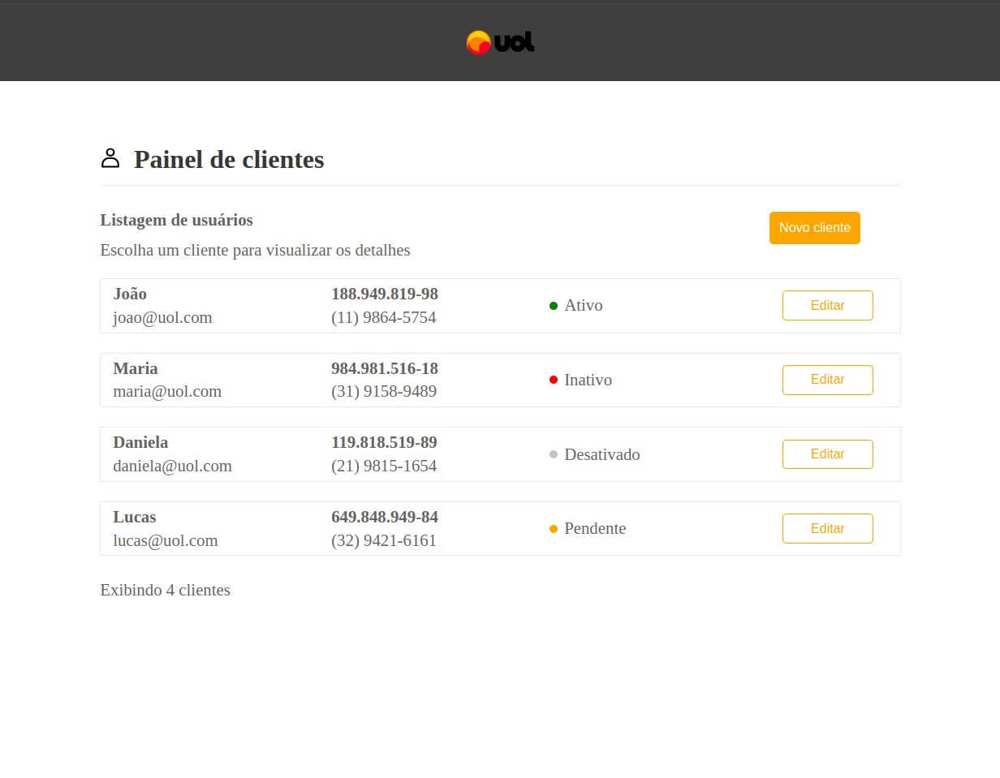
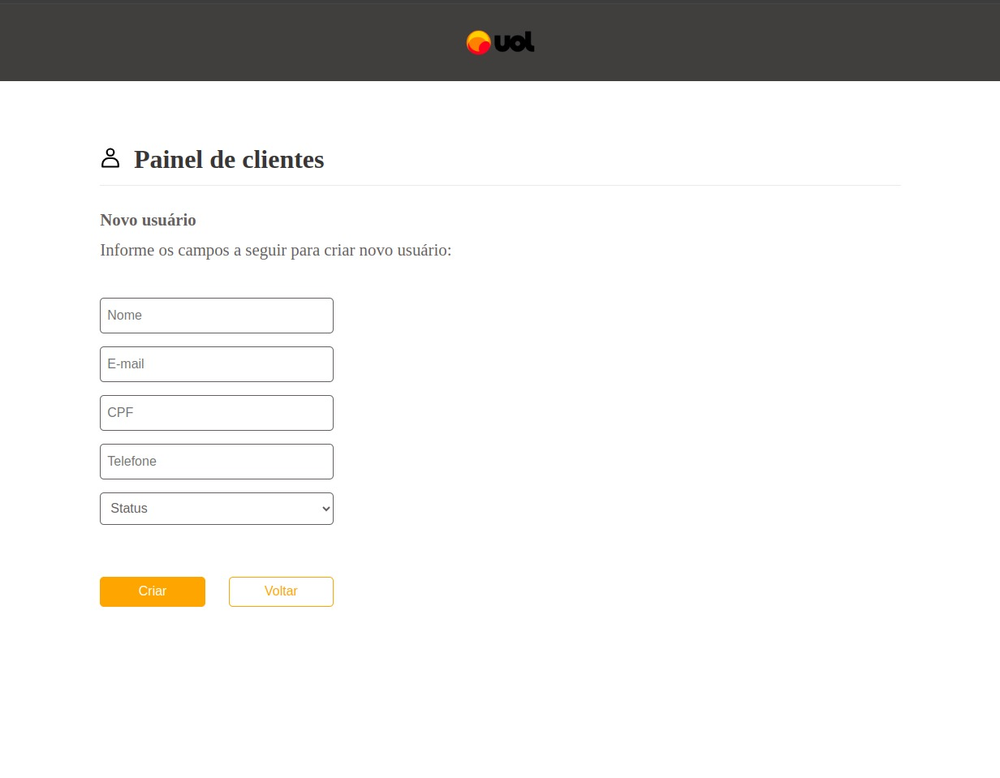
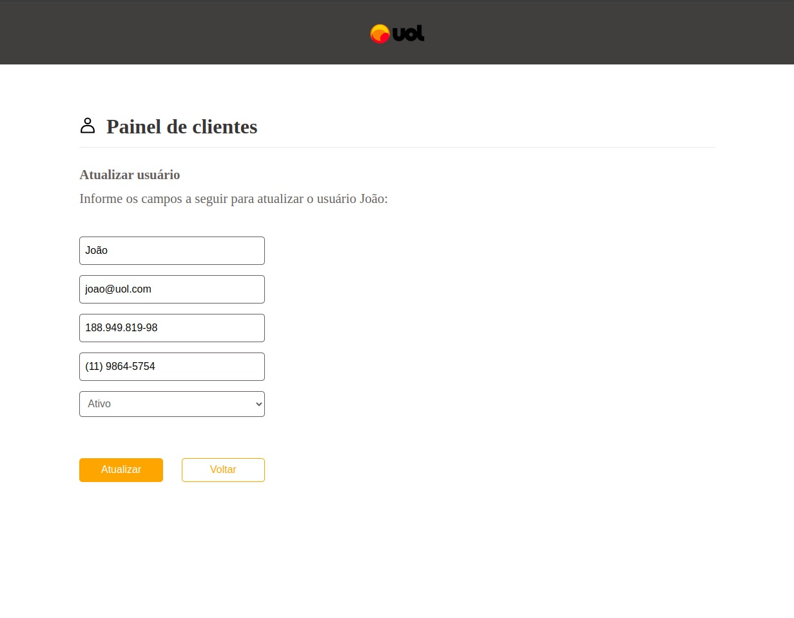
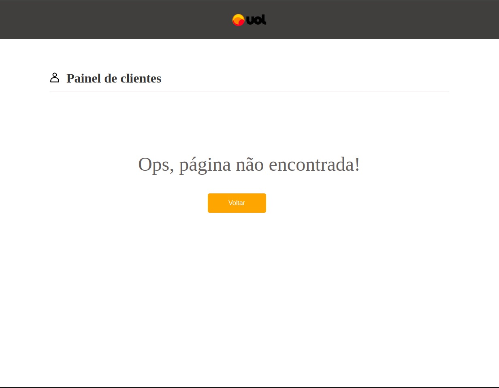

# Front-end

## Tecnologias utilizadas
- <a href="https://www.typescriptlang.org/" target="_blank">TypeScript</a>
- <a href="https://react.dev/" target="_blank">React</a>
- <a href="https://vitejs.dev/">Vite</a>
- <a href="https://reactrouter.com/en/main" target="_blank">React-router-dom</a>
- <a href="https://axios-http.com/docs/intro" target="_blank">Axios</a>
- <a href="https://www.docker.com/" target="_blank">Docker</a>
- <a href="https://eslint.org/">ESLint</a>
- <a href="https://vitest.dev/" target="_blank">ViTest</a>
- <a href="https://uiball.com/ldrs/" target="_blank">LDRS</a>

## Testes
Verifique se está dentro do repositório ```front-end``` e rode o comando ```npm test``` para testar as camadas service e controller.

## Funcionalidades
1) Página inicial com listagem de usuários

2) Página de criação de usuários ```/add```

3) Página de atualização de usuários ```/:id```

4) Página de rota não encontrada

